## ISD-Agent 사용 매뉴얼

### 1. 기본 접속

안내받은 **입장코드**를 입력하고 **입장하기**를 누르면 메인 페이지가 열립니다.
메인 페이지의 **시작하기** 버튼을 누르거나 좌측 사이드바에서 **에이전트 요약**을 선택해 작업을 시작합니다.

> 아래 이미지는 이전 버전의 로그인 화면입니다. 현재는 아이디·비밀번호 대신 입장코드를 사용합니다. 이후 예시 이미지의 화면 구성도 현재 버전과 일부 다를 수 있습니다.

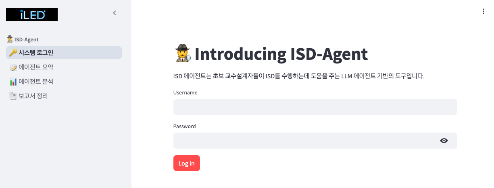

### 2. 사용 방법

먼저 [분석 파일 폴더](https://drive.google.com/drive/folders/10vIo1ZoNWA-QTjkFYyAR7cc7b8ic-MTu?usp=sharing)에서 준비물을 다운로드해주세요.

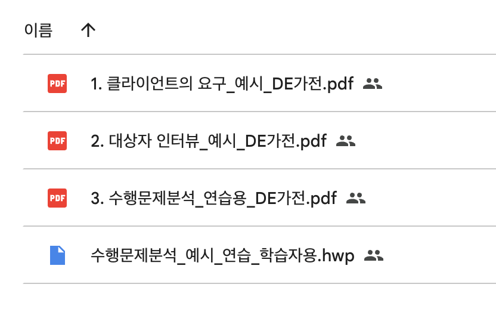

##### 2-1. 좌측 사이드바에서 **에이전트 요약** 페이지를 선택합니다. 메인 페이지에서 **시작하기**를 누른 경우에는 이 페이지로 바로 이동합니다.

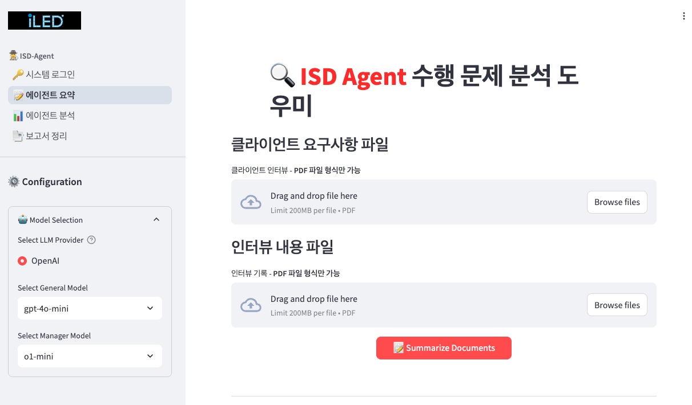

다음 분석용 예시 파일을 다운로드해 각각 **클라이언트 요구사항 파일**, **인터뷰 내용 파일**에 업로드합니다.

- [1. 클라이언트의 요구_예시_DE가전.pdf](https://drive.google.com/file/d/1hyKqKtgb8mLcJfi-8x8Rz9vL4HYasyz8/view?usp=drive_link)
- [2. 대상자 인터뷰_예시_DE가전.pdf](https://drive.google.com/file/d/1L_aNYOGDiy_l1AHE1tgGqTD9ICtM-O9j/view?usp=drive_link)

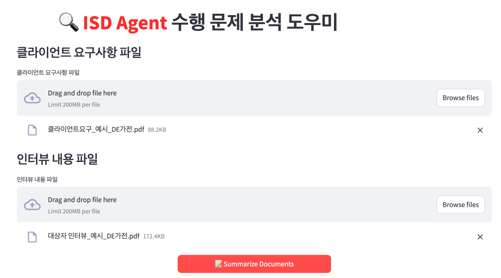

##### 2-2. **Summarize Documents**를 눌러 LLM이 제공하는 원자료 요약 결과를 받습니다.

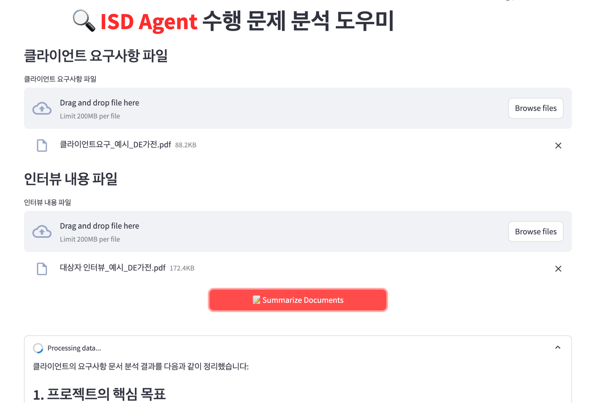

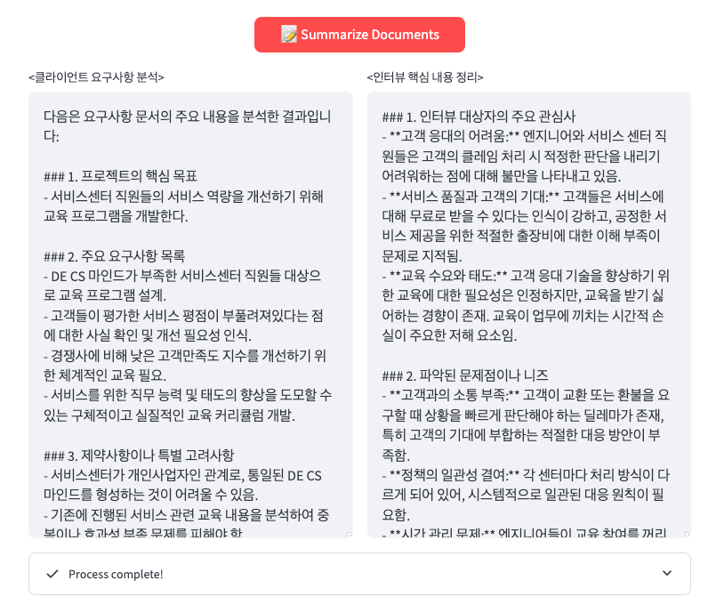

##### 2-3. 요약 내용을 확인하고, 수정이 필요하면 **텍스트 창에서 직접 수정**합니다.

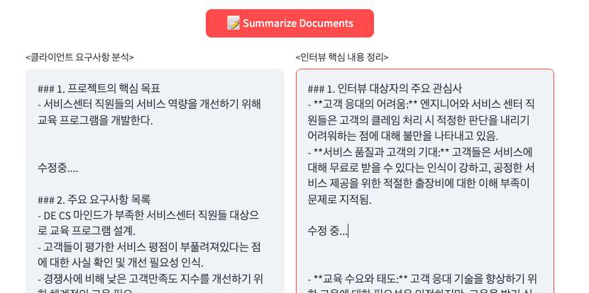

##### 2-4. 좌측 사이드바에서 **에이전트 분석** 페이지를 선택합니다.

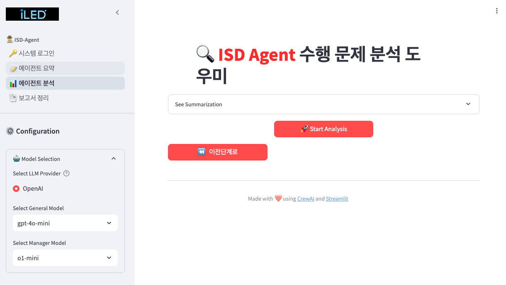

##### 2-5. **Start Analysis**를 눌러 LLM 에이전트 기반 수행문제 분석을 실행합니다.

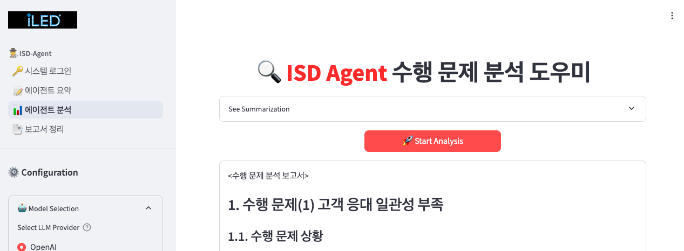

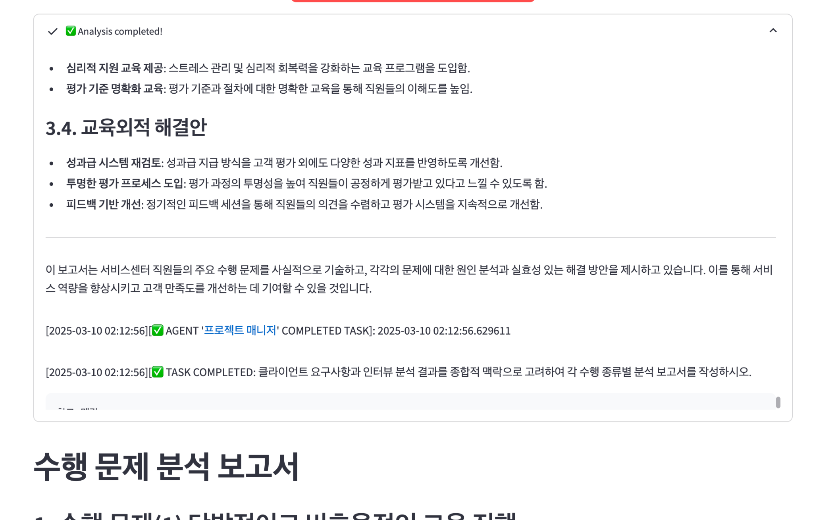

##### 2-6. 분석 결과에 수정이 필요하면 **추가 분석 지시사항**을 입력하고 **Re-Analysis**를 누릅니다. 요청을 구체적으로 작성할수록 원하는 방향으로 분석을 보완하기 쉽습니다.

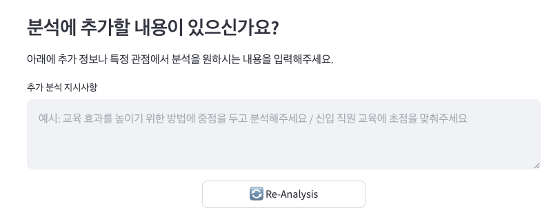

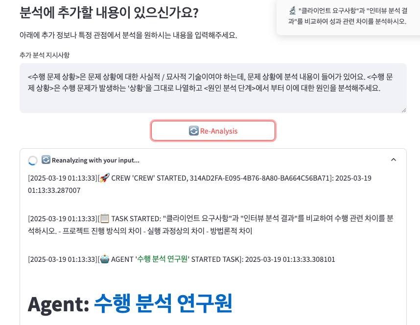

### 3. 최종 결과 도출

##### 3-1. 좌측 사이드바에서 **보고서 정리** 페이지로 이동합니다.
##### 3-2. 최종 결과를 확인하고 검토합니다. 보완이 필요하면 이전 단계로 돌아가 **Re-Analysis**를 다시 실행합니다.

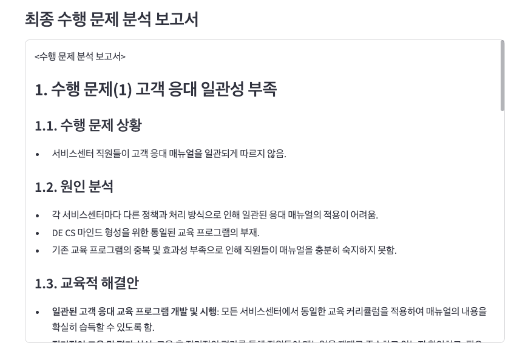

##### 3-3. 검토를 마치면 다운로드 영역에서 **수행문제 분석 보고서**를 내려받습니다.

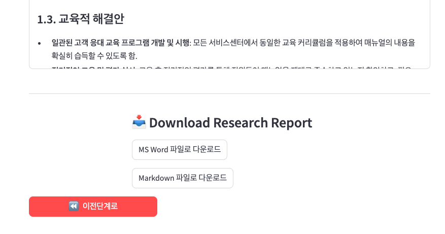

##### 3-4. **MS Word 파일로 다운로드**를 눌러 보고서를 저장하고 Word에서 확인합니다.

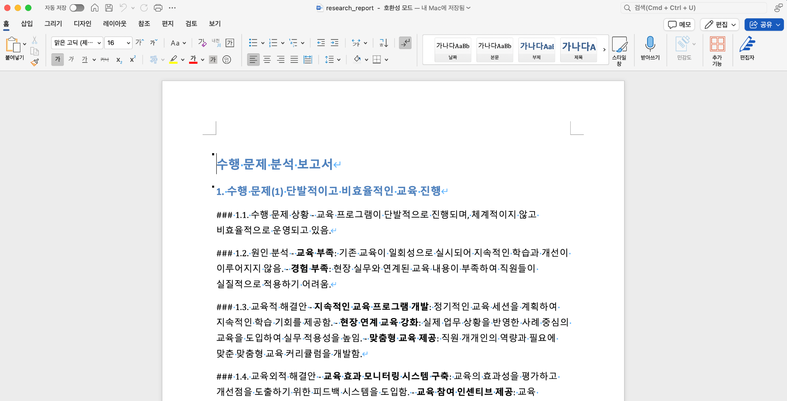

##### 3-5. **Markdown 파일로 다운로드**를 눌러 보고서를 저장합니다. 이 파일을 ChatGPT나 Claude에 첨부해 후속 질문을 할 수 있습니다.

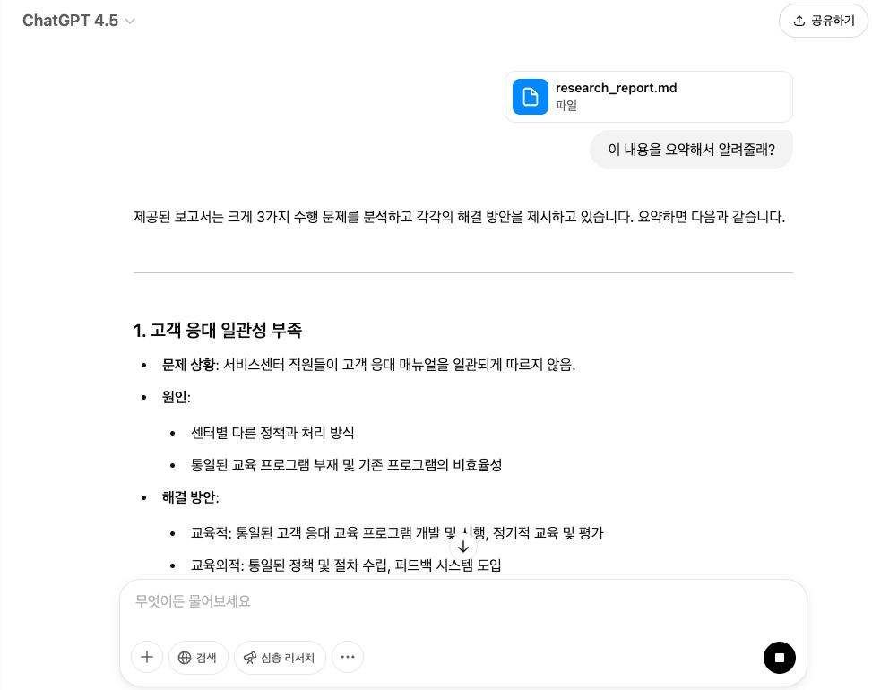
